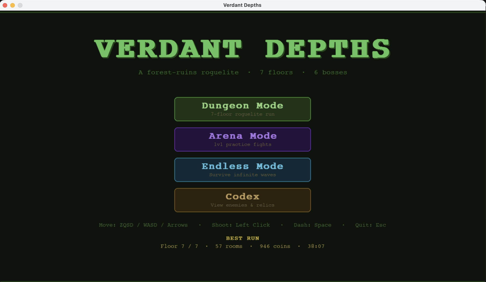
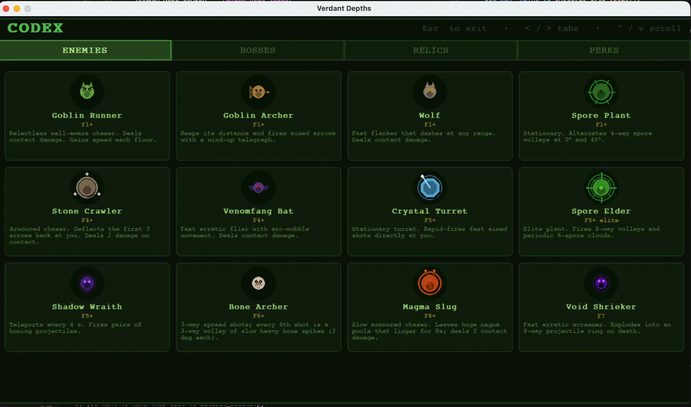
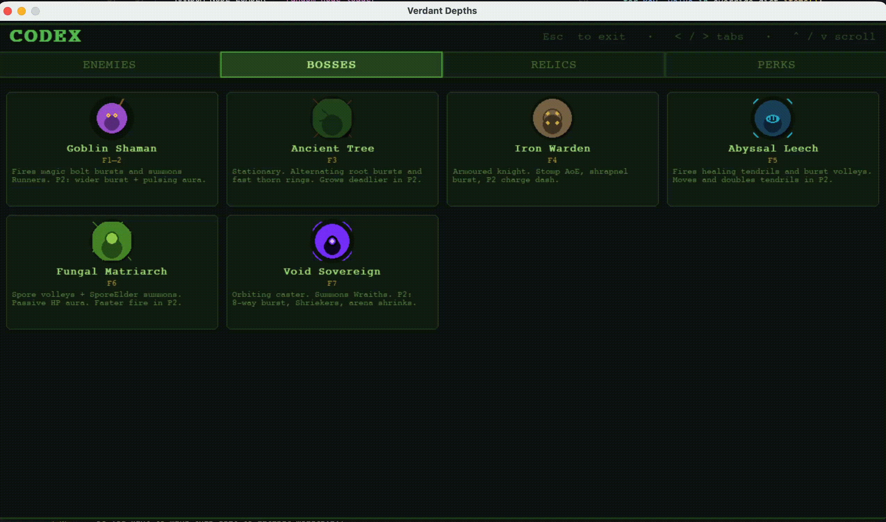
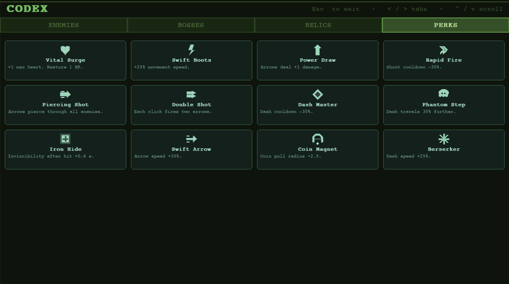
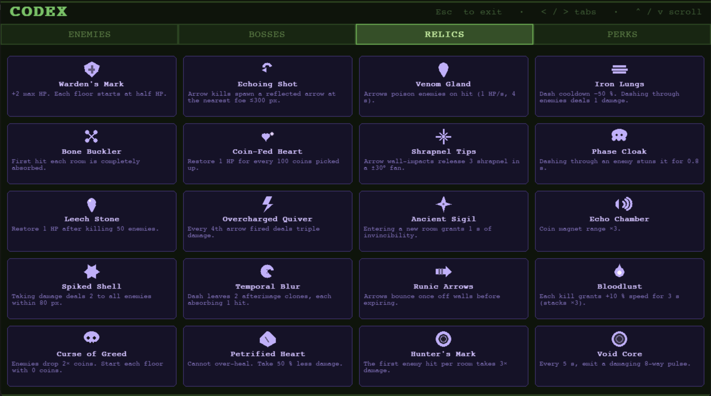

# Verdant Depths

A roguelite dungeon crawler set in overgrown forest ruins. Fight through 7 floors of increasingly dangerous enemies, collect perks and relics, and face powerful bosses on your way to the depths.

Built with [pygame-ce](https://pyga.me/) for a Game Jam with my friends in May 2026.



> 🎬 **Trailer**: [`assets/verdant_depth_trailer.mp4`](./assets/verdant_depth_trailer.mp4)

---

## Install & Run

**Requirements:** Python 3.11+ and [uv](https://docs.astral.sh/uv/getting-started/installation/)

```bash
git clone https://github.com/clementw168/gamejam-may-2026.git
cd gamejam-may-2026
uv run verdant-depths
```

**Key layout options** (default: ZQSD):

```bash
uv run verdant-depths --keys wasd
uv run verdant-depths --keys arrows
```

---

## How to Play

### Goal

Clear all rooms on each floor, defeat the boss, pick a relic, and descend — 7 floors total. Reach the bottom to win.

### Controls

| Input | Action |
|---|---|
| ZQSD / WASD / Arrows | Move |
| Mouse | Aim |
| Left Click | Shoot arrow |
| Space | Dash (invincible while dashing) |
| Esc | Pause/Quit |

### Core loop

- **Rooms** — each room spawns a wave of enemies; clear them all to open the doors and earn a perk choice
- **Boss** — defeating the floor boss lets you pick a **relic** before descending to the next floor
- **Shop** — one room per floor sells an HP vial and a perk for coins; enemies drop coins on death
- **Relics** — powerful passive items picked after each boss; stack and synergise across the run

---

## Game Modes

### 🗡️ Dungeon

The main mode. 7 floors of procedurally connected rooms, progressive difficulty, perks after combat rooms, a shop per floor, and a relic pick after each boss. Run stats and a best-run high score are tracked.

### ⚔️ Arena

Practice mode — pick any enemy or boss (and how many to spawn), pick an optional relic, then fight in a sealed room. No coins, no progression, no perks. Great for testing builds or learning enemy behaviours.

### ♾️ Endless

Infinite waves in a sealed room. Every 5-wave cycle rewards HP, perks, and relics (wave 5 spawns a boss and grants a full heal + relic choice). Difficulty scales with cycles — by cycle 6, every boss wave spawns 3 bosses at once. You can also start from a higher wave (multiples of 5) for an instant power spike — the game pre-rolls perks and relics for you before combat.

---

## Enemies

12 regular enemies unlock progressively across the 7 floors — from melee chasers to teleporting casters, fast erratic bats, and burn-patch slugs.



| Enemy | Floor | Behaviour |
|---|---|---|
| Goblin Runner | 1+ | Wall-aware melee chaser |
| Goblin Archer | 1+ | Ranged, keeps distance, telegraphed shots |
| Wolf | 1+ | Lunges across the room when off cooldown |
| Spore Plant | 1+ | Stationary, alternating 4-way spore volleys |
| Stone Crawler | 4+ | Armoured; deflects the first 3 arrows back at you |
| Venomfang Bat | 4+ | Fast erratic melee with arc wobble |
| Spore Elder | 5+ | Elite stationary — 8-way volleys + spore clouds |
| Crystal Turret | 5+ | Stationary rapid-fire aimed shots |
| Shadow Wraith | 5+ | Teleports every 4 s, fires homing projectiles |
| Bone Archer | 6+ | 3-way spread + bone-spike volleys every 4th shot |
| Magma Slug | 6+ | Slow melee, drops large burning patches |
| Void Shrieker | 7 | Fast erratic melee with 8-way death burst |

---

## Bosses

One unique boss per floor. Each boss has a **Phase 2** triggered around 50 % HP that changes their attack pattern, speeds up cooldowns, and adds new mechanics.



| Floor | Boss | Notes |
|---|---|---|
| 1–2 | **Goblin Shaman** | Bolt bursts + runner summons; gains pulsing aura in P2 |
| 3 | **Ancient Tree** | Root sprays + thorn rings, fully stationary; double rings + faster bursts in P2 |
| 4 | **Iron Warden** | Stomp AoE + shrapnel; patrols the room; P2 doubles stomp rate |
| 5 | **Abyssal Leech** | Homing tendrils that heal it on hit; starts moving in P2 |
| 6 | **Fungal Matriarch** | Spore volleys + Spore Elder summons; passive healing aura ≤80 px |
| 7 | **Void Sovereign** | 8-way bursts + Wraith summons; arena shrinks via void field in P2 |

---

## Perks

12 perks total. After clearing a combat room, you might be offered **3 random perks**; pick one. Stack them across the run to define your build.



Highlights: **Piercing Shot** (arrows pass through all enemies), **Double Shot** (every click fires two arrows), **Iron Hide** (longer i-frames after a hit), **Coin Magnet** (bigger pickup radius), **Berserker** (faster dash).

---

## Relics

20 relics total. After each floor boss, you're offered **2 random relics**; pick one. Relics enable powerful build synergies — e.g. **Venom Gland** + **Echoing Shot** + **Piercing Shot** turns every arrow into a poison-spreading reflected chain.



Highlights:
- **Echoing Shot** — arrow kills spawn a reflected arrow at the nearest enemy
- **Bone Buckler** — first hit in every room is absorbed for free
- **Temporal Blur** — dash leaves two afterimage clones that each absorb a hit
- **Hunter's Mark** — first enemy hit in every room takes ×3 damage
- **Void Core** — emit a damaging 8-way pulse every 5 s
- **Curse of Greed** — 2× coin drops, but every floor starts with 0 coins

---

## Credits

Built by Clement Wang for a Game Jam in May 2026. Powered by [pygame-ce](https://pyga.me/). All sounds are procedurally synthesised at runtime. Same for images.
